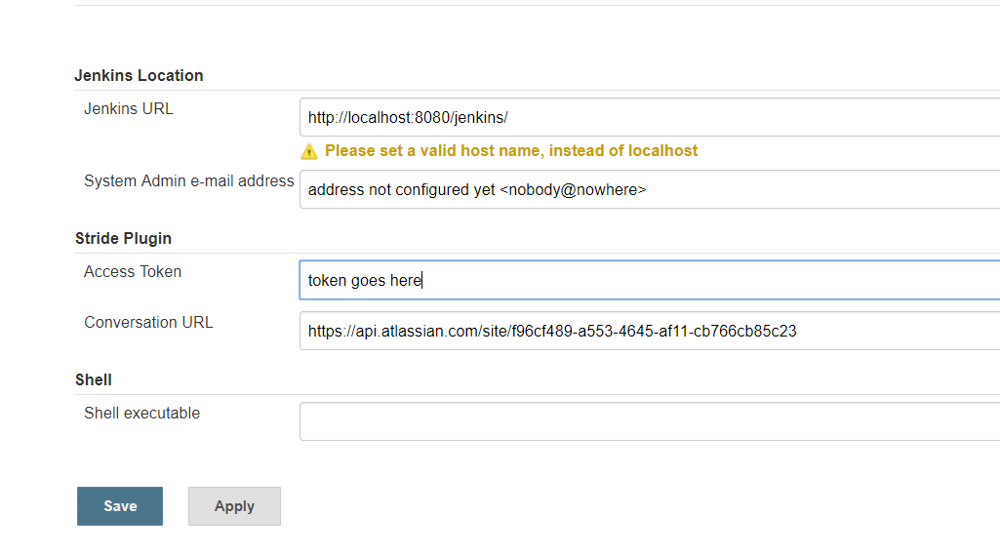
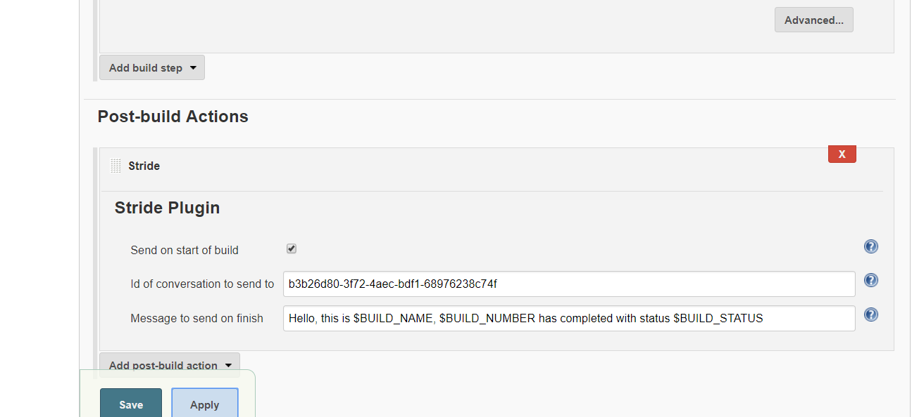
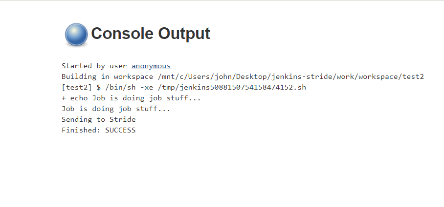

# jenkins-stride
Provides stride integration with jenkins

# How to Use
1. Configure Stride info in global configuration. Get the token from Stride's web UI.

2. Add Stride post build item

3. Run job and view message

